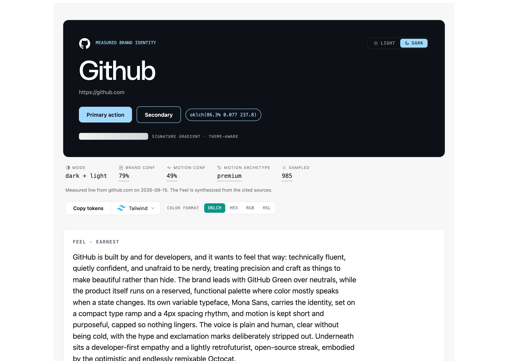

<p align="center">
  
</p>

<p align="center"><em>Measure a website's whole brand from the live page, then learn its feel.</em></p>

Point understudy at a URL. It drives a real browser, reads the computed brand off the rendered page (color, type, spacing, radii, and motion), and emits design tokens plus an interactive report. Your agent adds the qualitative feel on top, cited and reconciled against the measurement.

<p align="center">
  
</p>

## What it does

- **Measures computed values**, not a screenshot: the palette with roles and light/dark, type families and scale, spacing and radii, and the part others skip — **motion**: staggers, springs, scroll choreography, and requestAnimationFrame sequences.
- **Emits** a `design-model.yaml`, CSS variables, a Tailwind config, W3C DTCG tokens, and a self-contained interactive HTML report (OKLCH by default with a hex/rgb/hsl switch, a light/dark toggle, playable easing curves, and click-to-copy).
- **Adds the feel**: your agent writes a cited `rationale.json` from the brand's own design writing, and `understudy context` reconciles its stated numbers against what was measured.

## Why motion

Chrome's Animations panel can't see `requestAnimationFrame`, and GSAP, Lenis, and Framer Motion all run on it — which is where distinctive motion lives. Static analysis can't read it; screenshots can't either. understudy instruments the animation APIs and samples the moving properties frame by frame, so it recovers timing the others miss.

## Install

Node 22+. No account, no API key, no hosted service.

```bash
git clone https://github.com/Amir-Abushanab/understudy && cd understudy
pnpm install
pnpm exec playwright install chromium
```

`pnpm dev` runs from source; `pnpm build` compiles `dist/` and the `understudy` binary.

## Quickstart

```bash
pnpm capture https://linear.app -o model.yaml                                # measure -> design-model.yaml
pnpm capture https://linear.app --report report.html                         # + interactive HTML report
pnpm capture https://linear.app --css t.css --tailwind t.config.js --dtcg t.json   # + token formats
pnpm capture https://linear.app --rationale feel.json --report report.html   # + an authored feel
pnpm capture https://linear.app --merge ./design-model.yaml                  # splice motion into a Hue model
```

## From your coding agent

One canonical `SKILL.md`, discovered by every agent:

| Agent                | Invoke                                                          |
| -------------------- | -------------------------------------------------------------- |
| Claude Code          | `/understudy <url>`                                            |
| Codex                | `$understudy <url>`, or install the bundled plugin             |
| OpenCode / Kilo Code | auto-discovered; ask it to learn a URL's brand                 |
| Goose                | `goose run --recipe recipes/understudy.yaml --params url=<url>` |

**Install as a plugin** from this repo — Claude Code: `/plugin marketplace add Amir-Abushanab/understudy` then `/plugin install understudy@understudy`. Codex: `codex plugin marketplace add Amir-Abushanab/understudy` then `codex plugin add understudy@understudy`. OpenCode, Kilo, and Goose read the skill straight from the cloned repo.

The CLI measures the ground truth deterministically and spends no model tokens. The **feel** is the only token-heavy part: a web-research step that runs roughly **100K–300K tokens** for one site (`SKILL.md` breaks it down). `pnpm verify-agents` re-checks the wiring across all agents at once.

## What it emits

A `design-model.yaml` (abbreviated, from stripe.com):

```yaml
name: Stripe
primary_mode: light
confidence: { brand: 0.9, motion: 0.71 }
colors:
  light:                       # both light and dark when a site themes
    background: "#ffffff"
    text1: "#061b31"           # primary by contrast; text2 is the muted secondary
    accent: "#533afd"          # from buttons, links, and gradients
typography:
  families: [ sohne-var, SourceCodePro ]
  scale: [ 12, 14, 16, 18, 22, 26, 32, 48 ]
  display: { family: sohne-var, size: 48px, weight: 300, line_height: 1.15 }
spacing: [ 0, 8, 16, 24, 32, 48, 64 ]   # snapped to the detected base grid
radii: [ 0, 2, 4, 6, 8, 16 ]
motion:
  meta: { confidence: 0.71, passes: [scroll] }
  primitives:
    duration: { fast: 160, base: 240, slow: 420 }
    easing: { standard: [0, 0, 0.58, 1] }   # declared, cross-verified
  personality: { archetype: premium }
```

Colors are hex when opaque, `rgba(...)` when translucent. `--motion-only` emits just the `motion:` block. Validate any output with `node scripts/validate.mjs model.yaml` (exit 1 on error). The full contract is in [`understudy-spec.md`](./understudy-spec.md).

## Capture safety

The passes drive a real browser, so they are constrained:

- Never submit forms, never click destructive or transactional controls, never authenticate.
- Stay on the target origin; respect `robots.txt`; send a truthful, identifiable user-agent.
- One page at a time. `prefers-reduced-motion` is forced to `no-preference` so the real motion is measurable — the one place understudy overrides the page.

Extraction is user-initiated against a URL you name. No crawler, no corpus.

## Confidence and limits

`meta.confidence` reports real uncertainty: thin sampling, poor bezier fit, rAF truncated by the capture window, or motion that never ran during capture (off-screen, behind auth, or gated on an interaction the safe passes won't perform). A low number means the measurement was genuinely uncertain — treat it as authoritative, not a value to smooth over.

## Name and license

An understudy learns a performance by watching, then performs as itself: this tool studies a page's timing, not its artifact, and extracts only from URLs you supply. The bare npm name is taken, so it ships scoped as `@amir-abushanab/understudy` (confirm the scope matches your npm account before publishing). MIT, for upstream compatibility with [Hue](https://github.com/dominikmartn/hue).
